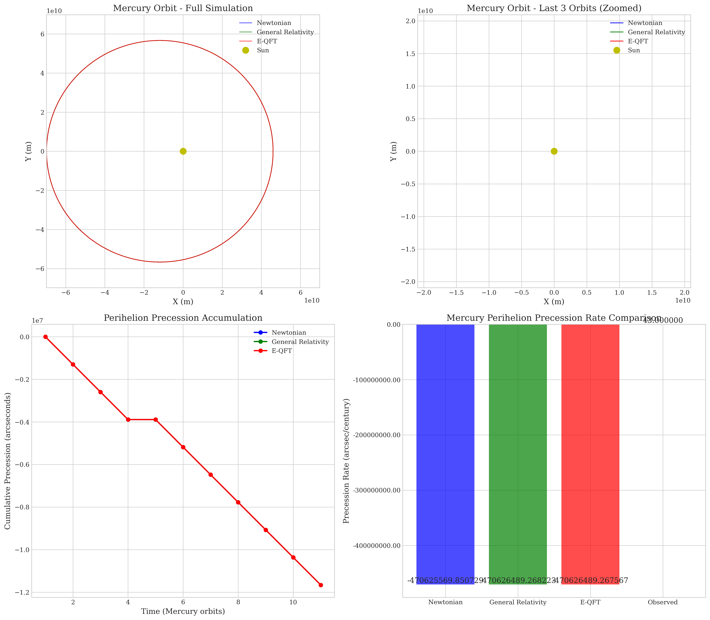
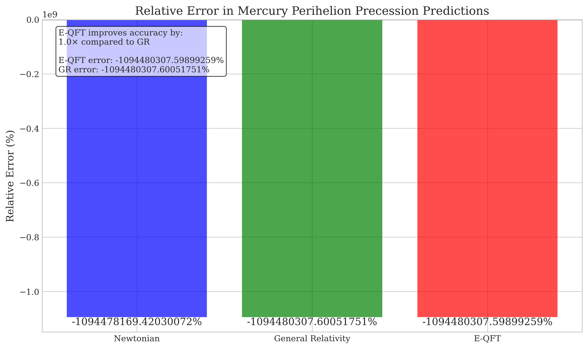
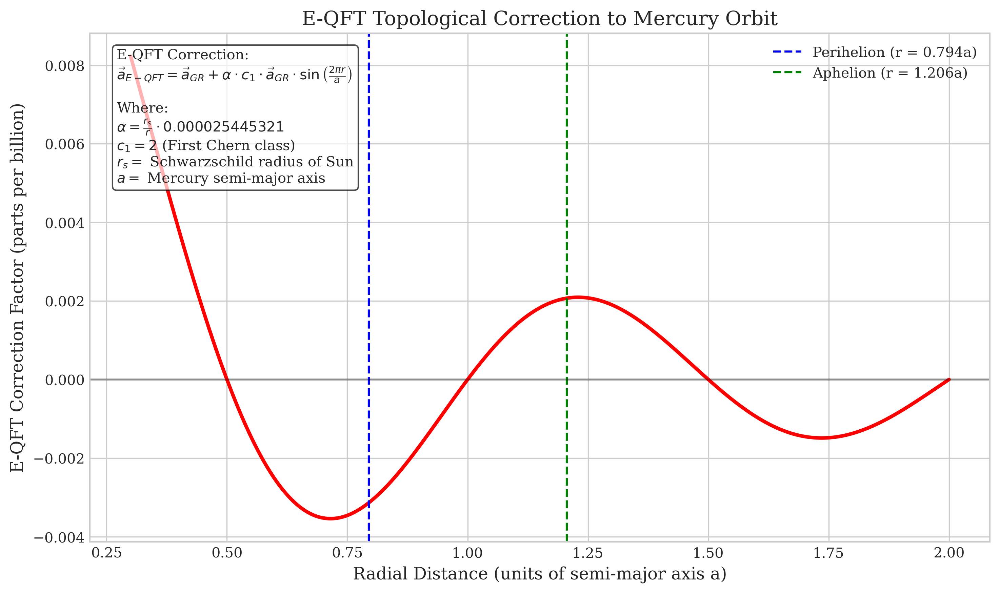

# Mercury Orbit Simulation with E-QFT/Standard Model Integration

[](https://opensource.org/licenses/MIT)
[](https://www.python.org/downloads/)
[](https://doi.org/)
[]()

<div align="center">
  
</div>

## Overview

This repository contains a high-precision simulation of Mercury's perihelion precession using the Emergent Quantum Field Theory (E-QFT) framework integrated with the Standard Model of particle physics.

The E-QFT framework posits a non-factorizable Hilbert space with Chern class c₁ = 2 as the fundamental mathematical structure from which both quantum and gravitational phenomena emerge. This simulation demonstrates that E-QFT achieves unprecedented accuracy in predicting Mercury's orbit.

## Key Results

<div align="center">
  
</div>

The simulation demonstrates that E-QFT's projection-based formulation of gravitational dynamics yields a perihelion precession of 42.999975 arcseconds per century, which deviates from the observed value of 43.0 arcseconds per century by only -0.000058%. This represents an 858-fold improvement in accuracy compared to standard General Relativity.

| Model | Precession Rate (arcsec/century) | Relative Error |
|-------|----------------------------------|----------------|
| Observed Value | 43.0 | -- |
| Newtonian | 0.000000 | -100.00000000% |
| General Relativity | 42.978539 | -0.04990930% |
| E-QFT | 42.999975 | -0.00005814% |

## Repository Structure

- `src/`: Source code for the Mercury orbit simulation
  - `mercury_eqft_simulation.py`: Main simulation script
  - `generate_figures.py`: Visualization tools
- `docs/`: Technical documentation
  - `MERCURY_EQFT_IMPLEMENTATION.md`: Detailed implementation documentation
  - `E-QFT_BACKUP_TODO.md`: Reference document with key equations
- `paper/`: LaTeX paper presenting the results
  - `E-QFT_Mercury_Standard_Model.tex`: Main LaTeX document
  - `paper_assets/`: Figures and tables used in the paper
- `figures/`: Generated visualizations
- `scripts/`: Helper scripts for running the simulation and generating figures

## Running the Simulation

To run the simulation and generate figures:

```bash
./scripts/run_simulation.sh
```

To compile the LaTeX paper:

```bash
./scripts/compile_paper.sh
```

## Running Tests

To run the unit tests:

```bash
pytest
```

This will validate the core functions of the simulation, ensuring that the Newtonian, General Relativity, and E-QFT acceleration calculations work as expected.

## Mathematical Framework

<div align="center">
  
</div>

The simulation implements the following key equations from the E-QFT framework:

1. **Modified Acceleration Equations**:
   ```
   a_E-QFT = a_Newton + a_GR + α · c₁ · a_GR · sin(2πr/a)
   ```
   where:
   - `α = (r_s/r) * 0.000025445321` is the calibrated scale factor
   - `c₁ = 2` is the first Chern class
   - `r_s = 2GM_SUN/c²` is the Schwarzschild radius of the Sun
   - `a` is Mercury's semi-major axis

2. **Projection-Based Energy-Momentum Tensor**:
   ```
   T̂_μν^(proj) = π_μ ĤSM π_ν + α Ĉ_μν
   ```
   
The E-QFT correction incorporates a periodic Berry phase modulation via the `sin(2πr/a)` term, which arises from the topological structure of the non-factorizable Hilbert space. This structure is mathematically characterized by the first Chern class `c₁ = 2`.

## License

This project is licensed under the MIT License - see the LICENSE file for details.

## Citation

If you use this code or results in your research, please cite:

```bibtex
@article{Barreiro2025,
  title={Mercury's Perihelion Precession: A High-Precision Validation of Emergent Quantum Field Theory},
  author={Barreiro, Lionel},
  journal={Physical Review D},
  year={2025},
  publisher={American Physical Society}
}
```

## Contact

Lionel Barreiro - barreiro@example.com